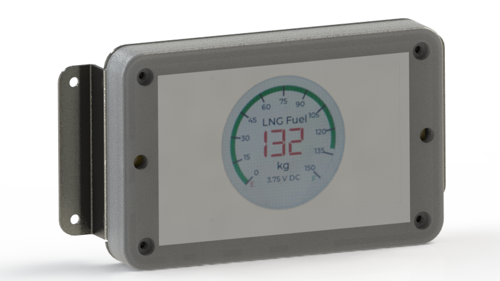

# SensorSync-IoT
Advanced 0-5V Analog Data Logger &amp; Real-Time Monitor | Wi-Fi, MQTT, SD Card | ESP32 Sunton HMI

  SensorSync IoT Documentation    .video-container { position: relative; padding-bottom: 56.25%; height: 0; overflow: hidden; max-width: 100%; } .video-container iframe { position: absolute; top: 0; left: 0; width: 100%; height: 100%; } body { font-family: 'Segoe UI', Tahoma, Geneva, Verdana, sans-serif; background-color: #f8f9fa; color: #343a40; transition: background-color 0.5s, color 0.5s; } .navbar { background-color: #343a40; transition: background-color 0.5s, color 0.5s; } .sidebar { position: fixed; top: 56px; left: 0; height: 100%; width: 250px; background-color: #3a3a3a; color: #fff; display: flex; flex-direction: column; padding-top: 20px; overflow-y: auto; transition: background-color 0.5s, color 0.5s; } .sidebar h3 { margin: 0; padding: 10px 0; text-align: center; font-size: 1.2rem; } .sidebar a { color: #fff; text-decoration: none; margin: 10px 20px; padding: 10px; text-align: left; border-radius: 5px; transition: background-color 0.3s, color 0.3s; } .sidebar a:hover, .sidebar a:focus, .sidebar a.active { background-color: #495057; color: #f8f9fa; } .toggle-theme-btn { cursor: pointer; color: #fff !important; } .content { margin-left: 270px; padding: 30px; transition: margin-left 0.5s, background-color 0.5s, color 0.5s; } .card { margin-bottom: 20px; border: none; border-radius: 10px; box-shadow: 0 0 15px rgba(0, 0, 0, 0.1); } .content img { max-width: 100%; height: auto; margin-top: 15px; border-radius: 10px; box-shadow: 0 0 15px rgba(0, 0, 0, 0.1); } .section-title { margin-top: 30px; margin-bottom: 15px; padding-bottom: 10px; font-size: 1.5rem; font-weight: bold; border-bottom: 3px solid #343a40; color: #be5c5c; } .list-group-item { border: none; padding: 10px; background-color: #f8f9fa; } .lead { margin-bottom: 20px; } .bg-dark-mode { background-color: #212529; color: #f8f9fa; } .navbar-dark-mode { background-color: #343a40; } .sidebar-dark-mode { background-color: #495057; } .card-dark-mode { background-color: #343a40; color: #f8f9fa; } .list-group-item-dark-mode { background-color: #495057; color: #f8f9fa; } .section-title-dark-mode { border-bottom-color: #f8f9fa; }

[SensorSync IoT](#)

### Table of Contents

[Introduction](#introduction) [Setup](#setup) [Usage](#usage) [Features](#features) [Potential Use Cases](#potential-use-cases) [Troubleshooting](#troubleshooting) [Web Interface](#web-interface) [Wi-Fi Setup](#wifi-setup) [Calibration](#calibration) [API Endpoints](#api-endpoints)

SensorSync IoT Documentation
============================

Comprehensive guide to set up, use, and maintain your SensorSync IoT device.

Introduction
------------

The SensorSync IoT is a versatile analogue IoT data-logger and indicator designed to provide seamless integration with various sensors that output analog signals ranging from 0-5V. It enables real-time monitoring and analysis of sensor data, making it an essential tool for various industrial and research applications.

Setup
-----

Follow these simple steps to set up your SensorSync IoT:

1.  Unbox the SensorSync IoT and ensure all components are present.
2.  Connect the power adapter to the device and plug it into an electrical outlet.
3.  Mount the device near your sensor and connect the analog sensors appropriately.
4.  Turn on the device and wait for it to boot up.
5.  Connect to the device's Wi-Fi hotspot to access the configuration portal or use the provided app for seamless setup. Configure your device by following the on-screen instructions to connect it to your local Wi-Fi network.

Usage
-----

After setting up your SensorSync IoT, you can start monitoring and logging sensor data. Here's how to use it:

*   **Monitor Data:** View real-time sensor data on the device's LCD screen and through the web interface or app.
*   **Log Data:** Log data to the SD card or transmit it to a cloud server via MQTT for further analysis.
*   **Access Data:** Download logged data from the SD card or view it remotely on your smartphone or computer.

Features
--------

##### Real-time Monitoring

The SensorSync IoT offers real-time monitoring of analog input values, which can be visualized on the LCD screen or recorded for further analysis.

##### MQTT Integration

Seamlessly connect the SensorSync IoT to your MQTT broker for real-time data transmission and remote monitoring.

##### SD Card Logging

Log data locally on an SD card with customizable intervals for offline analysis.

##### Programmable Scale and Measurement Units

Configure the input scale, title, and measurement units to match your specific application needs.

##### Advanced Calibration

Perform precise calibration of analog inputs to ensure accurate and reliable data readings.

Potential Use Cases
-------------------

*   **Industrial Monitoring:** Monitor industrial processes and equipment health.
*   **Environmental Monitoring:** Track environmental parameters such as temperature, humidity, and air quality.
*   **Research and Development:** Use data logging and real-time monitoring for experiments and industrial research projects.

Troubleshooting
---------------

If you encounter any issues, consult the following troubleshooting steps:

*   **SD Card Initialization Failed:** Ensure the SD card is properly inserted and formatted.
*   **Wi-Fi Connection Issues:** Verify Wi-Fi credentials and ensure the device is within range of the network.
*   **MQTT Connection Failed:** Check the MQTT broker address and port configuration.

Web Interface
-------------

The SensorSync IoT offers an intuitive web interface for configuration and monitoring. Here's how to access and use it:

1.  Open a web browser and enter the device's IP address.
2.  Log in with your credentials.
3.  Navigate through the dashboard to monitor real-time data, configure settings, and more.

### Dashboard

View real-time sensor data on the main dashboard.

### Settings

Configure device settings, including calibration, MQTT broker settings, and SD card logging options.

Wi-Fi Setup
-----------

To set up Wi-Fi on your SensorSync IoT device, follow these steps:

1.  Turn on the device and wait for it to boot up.
2.  Connect to the device-generated Wi-Fi hotspot named "AutoConnectAP".
3.  Open a web browser and go to `192.168.4.1` to access the Wi-Fi manager.
4.  Select your Wi-Fi network and enter the password, then click "Save".
5.  The device will reboot and connect to the configured Wi-Fi network.

Calibration
-----------

Calibrate your SensorSync IoT using the raw analog values from the info panel:

1.  Measure the maximum and minimum raw analog values from the sensor.
2.  Access the web interface to enter these values under the "Calibration" section.
3.  Enter the desired calibrated min-max values.
4.  Click "Save" to apply the calibration settings.
5.  Check the info panel to verify the calibrated values.

API Endpoints
-------------

Interact with the SensorSync IoT programmatically using the following API endpoints:

### Retrieve Live Data

Get live data from the device using the following endpoint:

    GET /liveData

Example: curl -X GET http://DEVICE\_IP/liveData

### Save Calibration Data

Save calibration data using the following endpoint:

    POST /calibrate

Example: curl -X POST -d "raw\_min=0&raw\_max=4095&cal\_min=0&cal\_max=100&interval=6&mqtt\_broker=broker.hivemq.com&mqtt\_port=1883" http://DEVICE\_IP/calibrate

[Made by hjLabs.in](https://hjlabs.in) | 2024

document.querySelector('.toggle-theme-btn').addEventListener('click', function() { document.body.classList.toggle('bg-dark-mode'); document.body.classList.toggle('text-light'); document.querySelectorAll('.card').forEach(card => { card.classList.toggle('card-dark-mode'); }); document.querySelectorAll('.list-group-item').forEach(item => { item.classList.toggle('list-group-item-dark-mode'); }); document.querySelectorAll('.section-title').forEach(title => { title.classList.toggle('section-title-dark-mode'); }); let icon = document.querySelector('.toggle-theme-btn i'); icon.classList.toggle('fa-moon'); icon.classList.toggle('fa-sun'); });

Introduction
------------

The SensorSync IoT is a versatile analogue IoT data-logger and indicator designed to provide seamless integration with various sensors that output analog signals ranging from 0-5V. It enables real-time monitoring and analysis of sensor data, making it an essential tool for various industrial and research applications.

\`\`\`